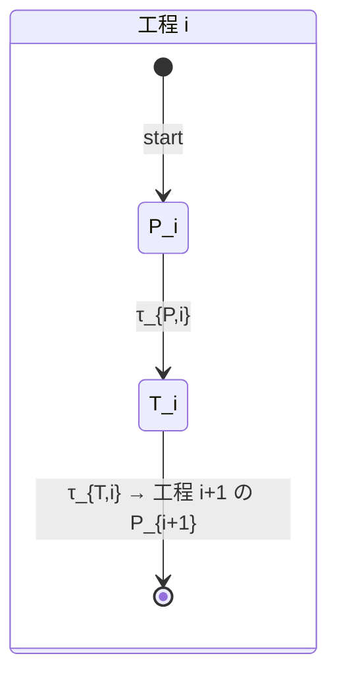
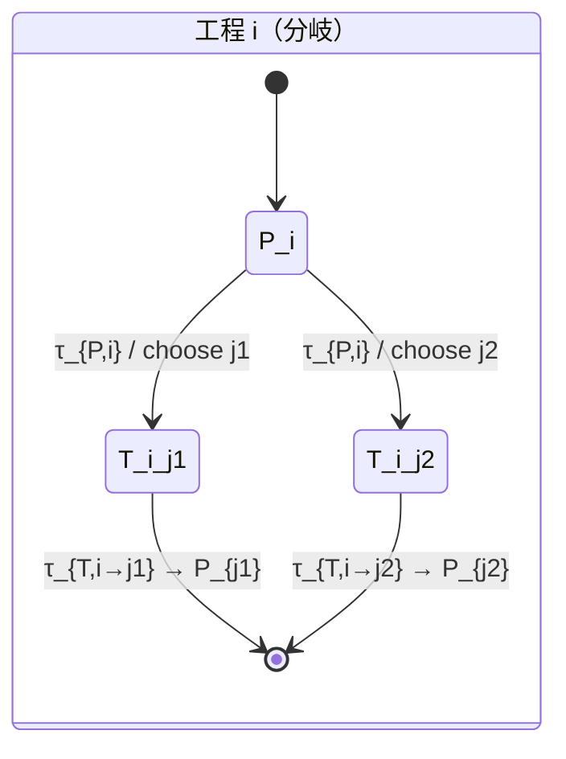
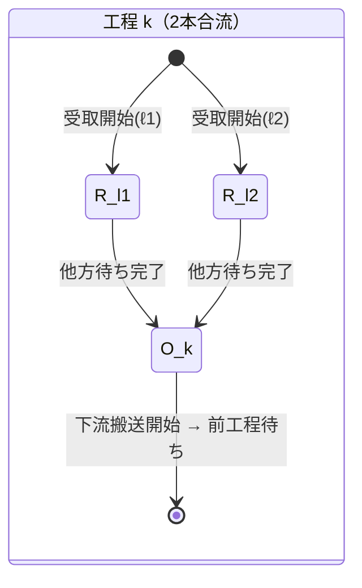
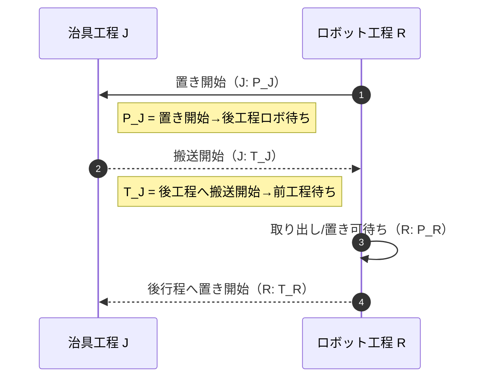

# 状態数最小化にもとづく離散事象シミュレーション  
**— 2状態（分岐・合流拡張）法のREADME —**

> 「各工程は2つの状態だけ」で大規模ラインも正確に再現する、現場計測に強い軽量DES（離散事象シミュレーション）モデル。

---

## 目次
- [概要](#概要)
- [コアアイデア](#コアアイデア)
- [数式定義](#数式定義)
- [図解（Mermaid）](#図解mermaid)
  - [直列ライン（基本）](#直列ライン基本)
  - [分岐のある工程](#分岐のある工程)
  - [合流のある工程](#合流のある工程)
  - [ロボット×治具の例](#ロボット治具の例)
  - [イベント駆動シミュレーションの流れ](#イベント駆動シミュレーションの流れ)
  - [ガントチャート例（概念）](#ガントチャート例概念)
- [クイックスタート](#クイックスタート)
- [設定ファイル例](#設定ファイル例)
- [アルゴリズム](#アルゴリズム)
- [指標と解析](#指標と解析)
- [計測と同定（現場導入）](#計測と同定現場導入)
- [ベンチマークと計算量](#ベンチマークと計算量)
- [FAQ](#faq)
- [プロジェクト構成案](#プロジェクト構成案)
- [開発・貢献](#開発貢献)
- [ライセンス](#ライセンス)

---

## 概要
本リポジトリは、**各工程を「2状態」だけで表す**ことで、状態空間爆発を避けつつ、生産ラインなどの離散事象を高速にシミュレーションする方法をまとめたものです。  
- 現場で**取りやすい境界イベント**（上下流への“待ち”に到達）で時間を区切るため、**誤差が累積しにくい**。  
- 直列 N 工程なら状態数は **2N**。分岐・合流も次数に比例した**最小拡張**で表現可能。  
- スループットは**ボトルネック支配**で直観的に設計・改善に使える。

---

## コアアイデア
各工程 \(i\) は同時に 1 ワークのみ保持するとして、取りうる状態を2つに縮約します。

1. **処理状態 \(P_i\)**  
   「前工程から搬送開始 → 後工程待ちに到達」まで
2. **搬送状態 \(T_i\)**  
   「後工程への搬送開始 → 前工程待ちに到達」まで

> これら2つの**半サイクル時間**を現場で計測し、ライン全体を**連結**してシミュレートします。  
> 分岐や合流があるときは、**出入次数に応じて必要最小限に状態を増やす**だけで済みます。

---

## 数式定義

- 工程 \(i\) の状態集合  
  \[
  S_i=\{P_i,\,T_i\},\quad |S_i|=2.
  \]

- 半サイクル時間  
  \[
  \tau_{P,i}>0:\;P_i\text{滞在時間},\qquad
  \tau_{T,i}>0:\;T_i\text{滞在時間}.
  \]

- 1サイクル時間  
  \[
  \tau_i=\tau_{P,i}+\tau_{T,i}.
  \]

- 直列ラインの全体状態空間  
  \[
  S=\prod_{i=1}^N S_i,\qquad |S|=2N.
  \]

- スループット（飽和・決定論的近似）  
  \[
  Q\approx \frac{1}{\max_i \tau_i}.
  \]

- 分岐（出次数 \(d_i\)）の最小拡張  
  \[
  S_i=\{P_i\}\cup\{T_{i\to j}\mid j\in\mathcal{N}^+(i)\},\quad |S_i|=1+d_i.
  \]

- 合流（入次数 \(m_k\)）の最小拡張（2本合流の例）  
  \[
  S_k=\{R_{\ell_1\to k},\ R_{\ell_2\to k},\ O_k\},\quad |S_k|=3.
  \]

---

## 図解（Mermaid）

> GitHubのMarkdownは Mermaid をサポートしています。下記ブロックはそのままREADMEで図として表示されます。

### 直列ライン（基本）



### 分岐のある工程



### 合流のある工程



### ロボット×治具の例



### イベント駆動シミュレーションの流れ

```mermaid
flowchart LR
    A[初期化
各工程をPで開始] --> B[最小終了時刻のイベントを取得]
    B -->|P_i終了| C[分岐規則 route(i) で j を選択]
    C --> D[ T_{i→j} を t+τ_T にスケジューリング ]
    B -->|T_{i→j}終了| E[ P_j を t+τ_P にスケジューリング ]
    D --> F{終了条件?}
    E --> F
    F -->|No| B
    F -->|Yes| G[統計出力
Q, WIP, 稼働率...]
```

### ガントチャート例（概念）

```mermaid
gantt
    title 概念ガント（工程 i と i+1）
    dateFormat  X
    axisFormat  %L
    section 工程 i
    P_i :a1, 0, 5
    T_i :after a1, 3
    section 工程 i+1
    P_{i+1} :b1, 8, 4
    T_{i+1} :after b1, 3
```



---

## クイックスタート

1) **（任意）Node.js でCLIを使う場合**
```bash
git clone <this-repo>
cd <this-repo>
npm i
npm run simulate -- -c examples/line.simple.json -H 3600
```

2) **ブラウザだけで試す場合**  
`/web/index.html` を開き、設定JSONを貼り付けて「Run」。Mermaid可視化、統計、ログを確認できます。

---

## 設定ファイル例

### `examples/line.simple.json`
```json
{
  "horizon_sec": 3600,
  "nodes": [
    {"id": "S1", "type": "station", "tauP": 5.0, "tauT": 3.0},
    {"id": "S2", "type": "station", "tauP": 4.0, "tauT": 4.0},
    {"id": "S3", "type": "station", "tauP": 6.0, "tauT": 2.5}
  ],
  "edges": [
    {"from": "S1", "to": "S2"},
    {"from": "S2", "to": "S3"}
  ],
  "warmup_sec": 120,
  "routing": "deterministic"
}
```

### 分岐つき
```json
{
  "nodes": [
    {"id": "S1", "type": "station", "tauP": 5, "tauT": {"S2":3.2, "S3":3.8}},
    {"id": "S2", "type": "station", "tauP": 4, "tauT": 4},
    {"id": "S3", "type": "station", "tauP": 6, "tauT": 2.5}
  ],
  "edges": [
    {"from": "S1", "to": "S2", "p": 0.6},
    {"from": "S1", "to": "S3", "p": 0.4}
  ],
  "routing": "probabilistic"
}
```

> `tauT` は枝ごとに指定可能（`{to: value}`）。`routing` は `deterministic|probabilistic|shortest-queue` などを想定。

---

## アルゴリズム

**イベント駆動（最小ヒープ）**
```text
initialize():
  for each station i:
    schedule( event(P_i), now + sample(τ_P,i) )

while now < H:
  (t, e) = pop_min_event()
  now = t
  if e is P_i:
     j = route(i)
     schedule( T_{i→j}, now + sample(τ_T,i→j) )
  else if e is T_{i→j}:
     schedule( P_j, now + sample(τ_P,j) )
  collect_stats()
```

- `sample(τ)` は決定値でも分布（ガンマ/対数正規/位相型）でもOK。  
- 小容量バッファは `T` 完了時に受け入れ可否を判定し、不可なら `T` の中に待ちを**内包**させる実装でシンプルに扱えます。

---

## 指標と解析
- **スループット近似**  
  \[
  Q \approx \frac{1}{\max_i \tau_i}
  \]
- **アイドル率**  
  \[
  \alpha_i \approx 1 - Q\,\tau_i
  \]
- **WIPとリードタイム**（開ループ流入率 \(\lambda\) の下で）  
  Littleの法則 \(L \approx \lambda \bar{T}\) を近似的に利用。

---

## 計測と同定（現場導入）

### ログからの半サイクル抽出（CSV例）
```csv
# k,i, t_start_from_up, t_reach_down_wait, t_start_to_down, t_reach_up_wait
1, S1,  0.00, 5.12, 5.20, 8.35
1, S2,  8.35, 12.21,12.30,16.31
...
```

各周回 \(k\) の推定：
\[
\tau_{P,i}^{(k)} = t^{\Downarrow}_{k,i}-t^{\downarrow}_{k,i},\quad
\tau_{T,i}^{(k)} = t^{\Uparrow}_{k,i}-t^{\rightarrow}_{k,i}.
\]
平均 \(\hat{\tau}_{P,i},\hat{\tau}_{T,i}\) を推定し、`config.json` へ反映。変動が大きい場合は分布同定（最尤・ブートストラップ）。

---

## ベンチマークと計算量
- **状態数**：直列 \(2N\)。分岐・合流でも**次数に比例**。  
- **イベント数**：シミュレーション時間 \(H\) に対して**線形**（≒半サイクル数）。  
- **比較優位**：作業細分モデルに比べ、実運用で必要なパラメータ数・計算量を大幅削減。長時間でも位相ずれが起きにくい。

---

## FAQ

**Q. バッファは扱える？**  
A. 工程間バッファ \(B_{i,i+1}\) を持たせ、`T` 完了時に空きを見て搬入。満杯なら待ちを `T` に内包（\(\tau_T\) の実測に乗る）するだけで実装できます。

**Q. 故障や段取り替えは？**  
A. 休止分布 \(D_i\) を \(P_i\) または \(T_i\) に合成（追加イベント）で表現可能です。

**Q. 2状態で足りるの？**  
A. 「待ち境界」で計測するため、詳細作業の合算誤差が累積しづらく、現場計測との整合が取りやすいのが利点です。必要なら状態を**次数に応じて**拡張（分岐/合流）します。

---

## プロジェクト構成案

```
.
├─ README.md
├─ package.json
├─ src/
│  ├─ simulator.ts        # イベント駆動の本体
│  ├─ routing.ts          # 分岐規則（確率/最短待ち等）
│  ├─ stats.ts            # スループット/稼働率/WIP
│  └─ loaders.ts          # JSON/CSV ローダ
├─ web/
│  ├─ index.html          # ブラウザUI（設定貼付→Run→メトリクス/図）
│  └─ mermaid-helper.js   # Mermaid描画
├─ examples/
│  ├─ line.simple.json
│  └─ branch.merge.json
└─ data/
   └─ sample_logs.csv     # 半サイクル計測のサンプル
```

---

## 開発・貢献
- Issue / Pull Request 歓迎です。  
- コーディング規約：TypeScript + ESLint、ユニットテストは Vitest/Jest を推奨。  
- 追加した指標・可視化（Mermaidテンプレ、ダッシュボード等）は `examples/` へ。

---

## ライセンス
MIT License

---

### バッジ例（任意で使用）


---

> 必要であれば、上記READMEを**英語版**に整形、あるいは**Seesaaブログ**向けにも再整形可能です。JSONスキーマやCLIの実装雛形も用意できます。
