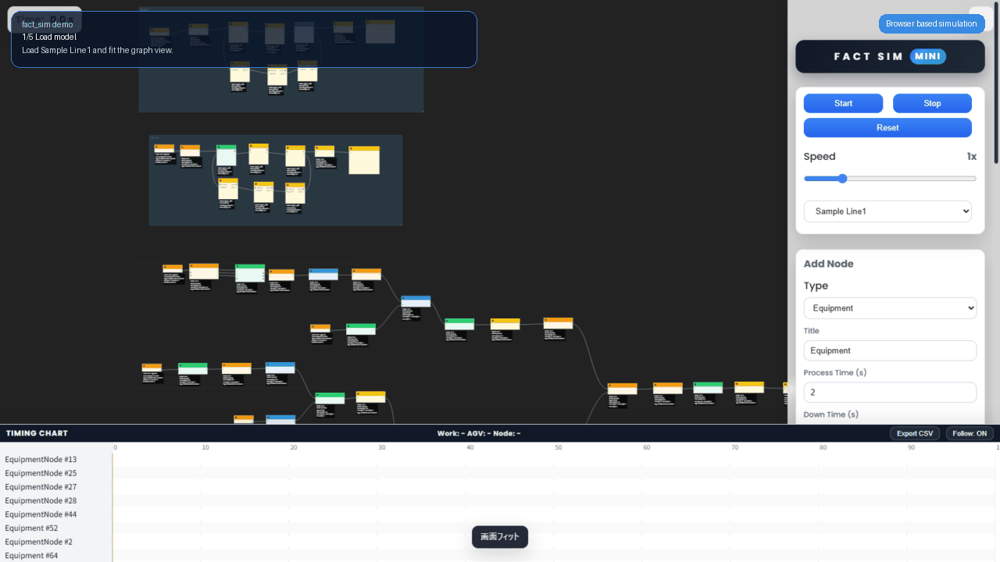

# fact_sim

[](https://suzuking001.github.io/fact_sim/)
[](LICENSE)
[](https://github.com/suzuking001/fact_sim)

**A general-purpose browser-based discrete-event simulator.**

`fact_sim` is an open-source, browser-based discrete-event simulator for modeling flows of work, resources, queues, transport, and state transitions.
It is especially strong for production-line design, but the core value is broader: it is a **general-purpose discrete-event simulator** that can be used anywhere entities move through events, buffers, routing, and timing constraints.

Manufacturing is the primary example in this repository, so the bundled nodes and samples focus on lines, equipment, AGVs, carriers, pallets, and stations. But the same engine and visualization approach can be applied to many other systems, such as logistics flows, warehouse operations, internal transport, service processes, and resource-constrained workflows.



## Live Demo
https://suzuking001.github.io/fact_sim/

## Core Message
fact_sim is not a tool for making flashy robot animations.
It is a **general-purpose discrete-event simulator** designed to explain why a system behaves the way it does, with second-level visibility into state transitions, routing, waiting, blocking, transport, and bottlenecks.

In manufacturing, that typically means questions like:

- Will the line meet takt?
- What throughput can we achieve?
- Where is the bottleneck?
- Are equipment, buffers, AGVs, and carriers sized correctly?

More generally, the same modeling approach helps answer:

- Where does work wait or accumulate?
- Which resource is constraining the system?
- How do routing rules change overall throughput?
- What happens if processing time, downtime, or transport capacity changes?

It runs fully in the browser and visualizes *why* a system meets or misses target via timing charts and CSV.
Before changing layouts, staffing, transport logic, or capital plans, it helps teams build decision-grade evidence fast.

## Why fact_sim
- Browser-native workflow for fast iteration
- Node-based modeling for generic event-driven systems
- Discrete-event simulation with practical engine options (`dt`, `event`, `event-fast*`)
- Explainable analysis with timing chart + CSV export
- Works well for both domain-specific industrial models and broader workflow simulation
- URL-based scenario sharing for fast team reviews

## Core Capabilities
- **Modeling:** Source, Equipment, Split, Branch, Merge, Join, Carrier Route, Carrier Config, Pallet Carrier Config, Station, Sink
- **Simulation:** engine switching, speed scaling, large scenario execution
- **Analysis:** timing chart, node highlighting, benchmark comparison, engine test, CSV export
- **Collaboration:** JSON save/load and shareable URL state

## Typical Use Cases
- Production lines and takt verification
- Warehouse and internal logistics flow simulation
- AGV, carrier, pallet, and transport routing studies
- Queueing and resource-capacity analysis
- General workflow simulation where entities move through states and events

## Quick Start (2 Minutes)
1. Open the live demo.
2. Select `Sample Line2`, `Sample Line1`, or `Carrier Config Example`.
3. Click `Start`.
4. Inspect `Timing Chart` to verify state transitions.
5. Export CSV when you need evidence for review.

## note Article Intro
“Moving visuals” make meetings easier.
But investment decisions need accountability, not aesthetics.

For over 15 years in production engineering, the key questions have remained:

- Where will it choke?
- How many units are actually needed?
- Why exactly does it miss target?

fact_sim was built to answer those questions at second-level resolution.
This article shares practical simulation design for real factories, not presentation-only DX.

## Run Locally
```bash
python -m http.server 8123
```
Open `http://127.0.0.1:8123`

Windows users can also start the local server with:

```bat
scripts/start_fact_sim_server.bat
```

The batch file prefers launching `http://127.0.0.1:8123` in Chrome when Chrome is installed, opens it in app mode with a fixed scale factor, and keeps browser features such as local example overwrite available.

Temporary verification screenshots should be saved under `tmp/`. Permanent exported artifacts such as reports, JSON, CSV, and optimizer outputs continue to live under `artifacts/`.

## Overnight Engine Optimization
The MCP package includes a guarded overnight loop for `event-fast*` engines.

```bash
cd mcp
npm run nightly
```

To let the loop automatically invoke Codex as the patch delegate for `event-fast*` fixes:

```bash
cd mcp
npm run nightly:auto-patch
```

This flow keeps `dt` and `event (heap)` protected, saves `engine_test` artifacts, generates `patch-request.json`, and validates that any auto-applied patch only touches the allowed `event-fast*` files.

For benchmark-driven overnight optimization of `event-fast*`, use:

```bash
cd mcp
npm run nightly:optimize
```

If you are token-constrained on ChatGPT Plus / Codex, use the lighter profile:

```bash
cd mcp
npm run nightly:optimize-lite
```

This optimizer first requires a clean worktree, then runs `quick` and `standard` engine tests, captures a benchmark baseline, asks Codex to optimize the selected `event-fast*` engine, reruns the tests, reruns the benchmark, and only keeps the patch when the target engine speed improves beyond the configured threshold.

## Documentation
- Quick reference (Japanese): `docs/quick-reference-ja.md`
- Research notes: `docs/research.md`
- Overnight optimizer guide: `docs/overnight-auto-optimize.md`
- Third-party notices: `THIRD_PARTY_NOTICES.md`

## Contributing
Issues and pull requests are welcome:
https://github.com/suzuking001/fact_sim/issues

## License
`fact_sim` is licensed under the [Apache License 2.0](LICENSE). Commercial use,
modification, and redistribution are permitted subject to the license terms.
Required attribution information is provided in [NOTICE](NOTICE).

Third-party components remain under their respective licenses. See
[THIRD_PARTY_NOTICES.md](THIRD_PARTY_NOTICES.md) for details.
