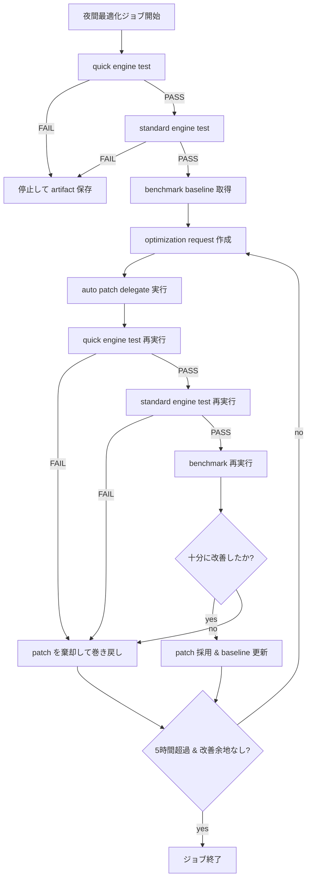
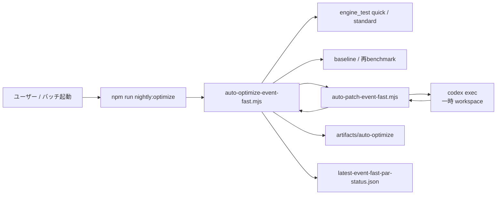
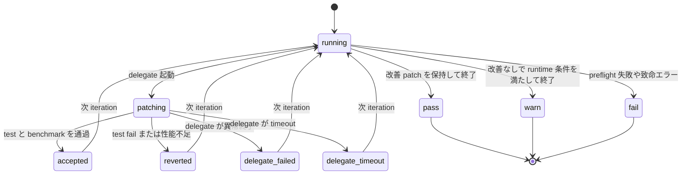

# 夜間ジョブ / 自動最適化ガイド

このドキュメントでは、`fact_sim` における `event-fast-par` 向け夜間最適化ジョブの仕組みを、日本語で整理して説明します。

目的は次の 4 つです。

- `dt` を正しさの基準として固定する
- 最適化対象を `event-fast-par` に限定する
- 5 時間以上の長時間ジョブとして安全に回す
- 正しさを壊さず、速度が改善した patch だけを採用する

## 何が夜間に実行されるのか

夜間ジョブは `mcp/` 配下で次のコマンドから起動します。

```bash
npm run nightly:optimize
```

既定のトークン保護では、AI delegateは最大6回、改善なしが3回続くと停止し、
1回のdelegate実行を8分までに制限します。長時間探索はオプションの明示指定が必要です。

現在の既定設定は次のとおりです。

- 対象エンジン: `event-fast-par`
- ベンチマーク用 example: `parallel_benchmark`
- 検証スイート: `quick`, `standard`
- 正しさの基準エンジン: `dt`

## 全体フロー



## 実行アーキテクチャ



## なぜ `dt` を基準にするのか

`dt` はこのリポジトリでは「正しさ確認用の基準エンジン」として扱います。

つまり、`event-fast-par` の patch は速くなるだけでは不十分で、少なくとも `dt` に対して次の parity を維持する必要があります。

- 完了数 parity
- work flow parity
- 状態遷移 parity
- タイミングチャート parity
- strict final parity

この制約によって、

- 速くなったが挙動が変わった
- 一見 throughput が上がったがモデルが壊れた

といった危険な patch を防ぎます。

## 最適化対象の制限

夜間最適化では、触ってよいファイルを厳しく制限しています。

`event-fast-par` 向けの主な対象は次です。

- `js/app/engine-fast-par-host.js`
- `js/app/engine-fast-par-worker.js`
- `js/app/engine-fast-par-partitioner.js`
- 必要に応じて許可された `event-fast*` runtime 周辺

一方、次は保護対象です。

- `dt`
- `event`

つまり、夜間ジョブは `dt` や `event(heap)` を勝手に書き換えません。

## artifact の保存先

各セッションは次のようなディレクトリに保存されます。

```text
artifacts/auto-optimize/<timestamp>__<label>/
```

代表的なファイル:

- `session.json`
- `summary.md`
- `preflight-quick.json`
- `preflight-standard.json`
- `benchmark-baseline.json`
- `optimization-request.iteration-<n>.json`
- `patch-result.iteration-<n>.json`
- `benchmark-after.iteration-<n>.json`
- `benchmark-delta.iteration-<n>.json`

これらを見ると、

- どの iteration が失敗したか
- patch は受理されたか
- benchmark はどれだけ改善したか

を追跡できます。

## リアルタイム監視

最新 status は常に次へ出力されます。

```text
artifacts/auto-optimize/latest-event-fast-par-status.json
```

リアルタイム監視は次で起動できます。

```bash
cd mcp
npm run watch:auto-optimize
```

Windows では次のバッチでも開けます。

```bat
scripts/watch_event_fast_par_status.bat
```

監視画面で見られるもの:

- current session id
- 現在の improvement %
- latest iteration の状態
- recent session files
- stdout / stderr の末尾ログ

## status の遷移



## 停止条件

ジョブは「5 時間経過したら即終了」ではありません。

終了条件は次の 2 つを両方満たすことです。

1. 少なくとも 5 時間経過している
2. 一定回数以上、改善が出ていない

現在の既定値:

- `minRuntimeHours = 5`
- `maxNoImprovementIterations = 60`

つまり、5 時間を超えていても改善が続いている間は継続し、逆に 5 時間未満では改善が止まっても終了しません。

## patch の採用条件

patch は次をすべて満たしたときだけ採用されます。

- `quick` が PASS
- `standard` が PASS
- target engine の benchmark が閾値以上改善
- 許可外ファイルを触っていない

1 つでも外れた場合は棄却し、baseline は据え置きます。

## 代表的な失敗パターン

よく出る status:

- `delegate-failed`
  patch delegate が非 0 で終了
- `delegate-timeout`
  delegate が時間内に終わらない
- `reverted-quick-fail`
  速いが quick parity を壊した
- `reverted-standard-fail`
  quick は通るが standard で壊れた
- `reverted-no-improvement`
  正しさは維持したが、性能改善が閾値未満

## 朝に確認すべき順番

夜間ジョブの結果確認は次の順が効率的です。

1. `latest-event-fast-par-status.json`
2. 最新 session の `summary.md`
3. `session.json`
4. `benchmark-delta.iteration-<n>.json`

解釈の目安:

- `PASS`
  改善 patch が少なくとも 1 件採用された
- `WARN`
  正しさは維持されたが、採用できる改善が無かった
- `FAIL`
  preflight かシステム上の問題で最後まで回せなかった

## すぐ使うコマンド

夜間最適化を開始:

```bash
cd mcp
npm run nightly:optimize
```

リアルタイム監視:

```bash
cd mcp
npm run watch:auto-optimize
```

Windows 監視バッチ:

```bat
scripts/watch_event_fast_par_status.bat
```
