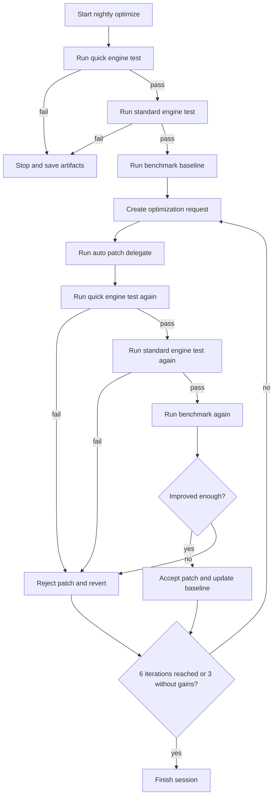
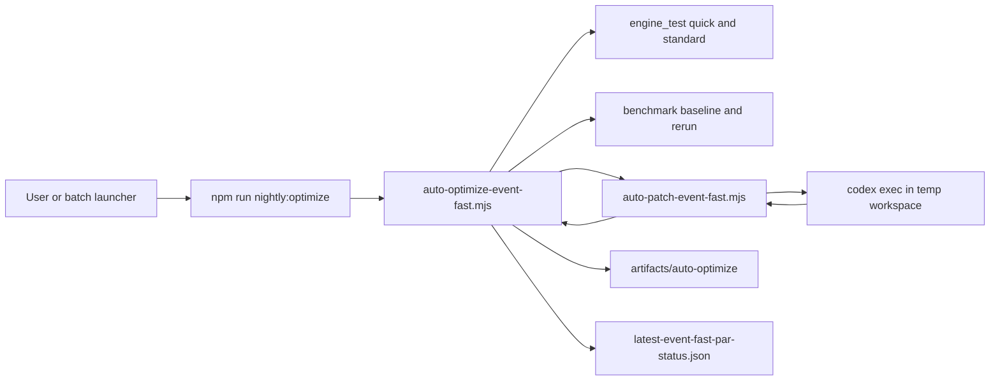
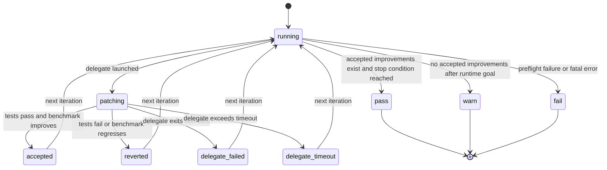

# Overnight Auto-Optimize Guide

This document explains the overnight optimization flow for `event-fast-par` in `fact_sim`.

The goal is simple:

- keep `dt` as the correctness baseline
- optimize only `event-fast-par`
- run for at least 5 hours
- keep only patches that pass engine tests and improve benchmark speed

## What Runs Overnight

The nightly job is started from `mcp/`:

```bash
npm run nightly:optimize
```

The default token guardrails limit the AI delegate to 6 iterations, stop after 3
consecutive iterations without improvement, and cap each delegate run at 8 minutes.
Longer exploration requires explicit command-line overrides.

The optimizer currently targets:

- engine: `event-fast-par`
- benchmark example: `parallel_benchmark`
- verification suites: `quick`, `standard`
- baseline engine: `dt`

## High-Level Flow



## Runtime Architecture



## Why `dt` Is the Baseline

`dt` is treated as the stable reference engine.

Every accepted optimization must preserve parity against `dt` through:

- completion count parity
- work-flow parity
- state transition parity
- timing chart parity
- strict final parity when enabled

This keeps the optimizer from making `event-fast-par` faster by silently changing behavior.

## Guard Rails

Only a narrow set of files is allowed to change during optimization.

For `event-fast-par`, the optimizer is restricted to:

- `js/app/engine-fast-par-host.js`
- `js/app/engine-fast-par-worker.js`
- `js/app/engine-fast-par-partitioner.js`
- related `event-fast*` runtime files when explicitly allowed

Protected engines are never auto-patched:

- `dt`
- `event`

If a patch touches forbidden files, it is rejected.

## Session Artifacts

Each run creates a session folder under:

```text
artifacts/auto-optimize/<timestamp>__<label>/
```

Typical files:

- `session.json`
- `summary.md`
- `preflight-quick.json`
- `preflight-standard.json`
- `benchmark-baseline.json`
- `optimization-request.iteration-<n>.json`
- `patch-result.iteration-<n>.json`
- `benchmark-after.iteration-<n>.json`
- `benchmark-delta.iteration-<n>.json`

These artifacts make it possible to inspect why a patch was accepted or rejected.

## Real-Time Monitoring

The latest status file is always updated here:

```text
artifacts/auto-optimize/latest-event-fast-par-status.json
```

Use the monitor to watch the job in real time:

```bash
cd mcp
npm run watch:auto-optimize
```

Windows shortcut:

```bat
scripts/watch_event_fast_par_status.bat
```

The monitor shows:

- current session id
- current improvement percent
- current iteration and state
- recent session files
- stdout and stderr log tail

## Status File Lifecycle



## Stop Conditions

The optimizer keeps running until both are true:

1. at least 5 hours have passed
2. no further improvement is found for the configured no-improvement window

Current defaults:

- `minRuntimeHours = 5`
- `maxNoImprovementIterations = 60`

This means the job does not stop immediately after 5 hours if it is still finding improvements.

## Acceptance Rule

A patch is accepted only when all of the following are true:

- `quick` passes
- `standard` passes
- the target engine benchmark improves by at least the configured threshold
- forbidden files were not touched

Otherwise the patch is rejected and the previous baseline stays in place.

## Failure Modes to Watch

Common cases:

- `delegate-failed`
  The patch delegate exited with an error.
- `delegate-timeout`
  The delegate exceeded the configured timeout.
- `reverted-quick-fail`
  The patch broke fast verification.
- `reverted-standard-fail`
  The patch passed quick but failed broader verification.
- `reverted-no-improvement`
  The patch was correct but did not improve performance enough.

## Recommended Morning Review

After an overnight run, check these in order:

1. `latest-event-fast-par-status.json`
2. the newest `artifacts/auto-optimize/<session>/summary.md`
3. accepted iteration entries in `session.json`
4. any `benchmark-delta.iteration-<n>.json`

If the result is `WARN`, it usually means:

- the system stayed correct
- no safe speedup was accepted

If the result is `PASS`, at least one patch was accepted and benchmark speed improved.

## Quick Command Reference

Start overnight optimization:

```bash
cd mcp
npm run nightly:optimize
```

Watch status:

```bash
cd mcp
npm run watch:auto-optimize
```

Windows watch shortcut:

```bat
scripts/watch_event_fast_par_status.bat
```
