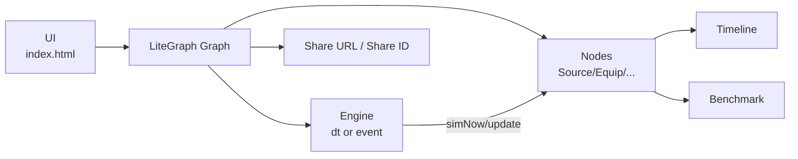
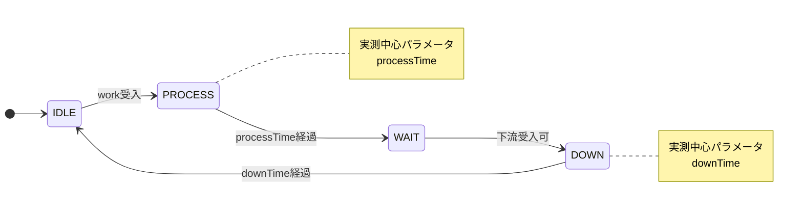
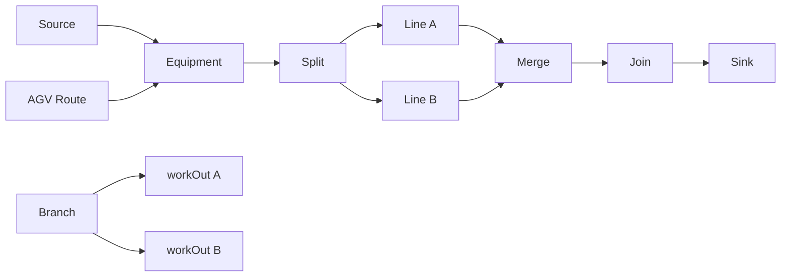
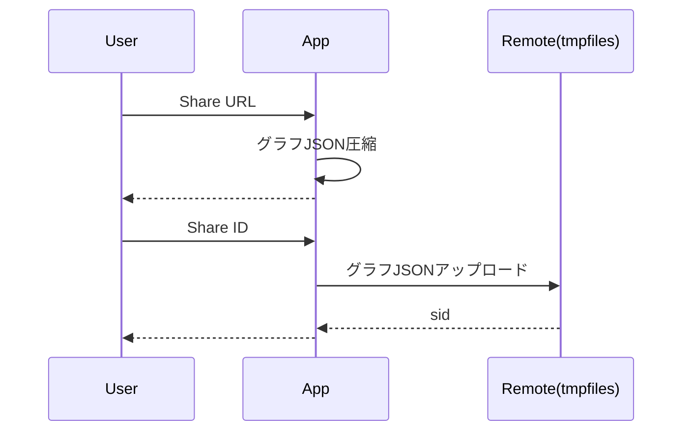

# fact sim mini 実装README

この README は **現在の実装** に合わせた仕様説明です。

## 概要
`fact sim mini` は LiteGraph.js ベースのブラウザ向け生産ラインシミュレータです。  
ノードを接続してワーク搬送をモデル化し、`dt` / `event` エンジンでシミュレーションできます。

- 対応エンジン: `dt`（固定刻み） / `event`（イベント駆動）
- 対応ノード: Source / Equipment / Split / Branch / Merge / Join / AGV Route / Sink
- タイムライン表示、CSVエクスポート、Share URL / Share ID 共有に対応


## 記号統一（論文向け）
論文原稿では、以下の記号に固定して記述すると読み手に伝わりやすくなります。

| 記号 | 意味 |
|---|---|
| `n` | ノード（工程） |
| `w` | ワーク |
| `s_n(t)` | 時刻 `t` におけるノード `n` の状態 |
| `S = {IDLE, PROCESS, WAIT, DOWN}` | ノード状態集合 |
| `T_p(n)` | ノード `n` の `processTime` |
| `T_d(n)` | ノード `n` の `downTime` |
| `TP` | スループット（単位時間あたり完了数） |
| `WIP` | 仕掛在庫数（Work In Process） |

## 全体像（Mermaid）
Figure 1. システム全体像（UI・グラフ・エンジン・可視化・共有の関係）



## 理論モデルとの関係（重要）
本実装は、理論上の「2状態最小モデル（P/T）」を実運用向けに拡張した形です。  
各工程ノード（Equipment系）は `IDLE / PROCESS / WAIT / DOWN` の4状態で動きますが、
**主要な実測パラメータは `PROCESS` と `DOWN` の2つ**に集約されています。

- `PROCESS` / `DOWN`:
  実機で時間計測しやすい主要区間（モデル同定の中心）
- `IDLE` / `WAIT`:
  上下流の受入条件から決まるゲート状態（追加の時間パラメータを基本要求しない）

このため、理論の狙いである「状態・計測・計算の簡素化」は、現実装でも維持されています。
状態遷移の定義は Figure 2 の通りです。

Figure 2. Equipment系ノードの状態遷移（4状態）



## この実装のメリット（理論意図の継承）
- **状態空間の抑制**  
  細分化タスクモデルに比べ、工程ごとの状態定義を小さく保てます。
- **実機測定工数の削減**  
  各工程で主に `processTime` と `downTime` を取ればモデル化可能です。
- **計測誤差の積み重ね抑制**  
  `WAIT/IDLE` 境界で事象を同期するため、細かい作業分解より誤差が累積しにくい設計です。
- **計算負荷の低減**  
  特に `event` エンジンでは `_until` を使った時間ジャンプで、不要な刻み更新を減らせます。

## ノード仕様
### Source (`factory/source`)
- `sequence`（例: `A,B`）に基づいて Work を生成
- 下流が受入可能なときのみ `workOut` へ出力

### Equipment (`factory/equip`)
- 入力: `workIn`
- 出力: `workOut`
- 主要プロパティ: `processTime`, `downTime`, `script`, `sigExtra`, `sigEnabled`
- 状態遷移: `IDLE -> PROCESS -> WAIT -> DOWN -> IDLE`

### Split (`factory/split`)
- `workOut` を2本以上持てる（右クリックで add/remove）
- 分岐先すべてが受入可能なとき、同一IDの Work を複製して同時出力

### Branch (`factory/branch`)
- `workOut` を2本以上持てる（右クリックで add/remove）
- `work.type` と出力ポートの `routeType` 一致で経路選択
- 出力ラベル（`workOut A` など）クリックで `routeType` 編集

### Merge (`factory/merge`)
- `workIn` を2本以上持てる（右クリックで add/remove）
- 接続入力を順に受理し、同一IDで揃ったら下流へ1つ出力
- ID不一致時はエラー扱い

### Join (`factory/join`)
- `workIn` を2本以上持てる（右クリックで add/remove）
- 複数入力から到着順（first-come-first-served）で通過

### AGV Route (`factory/agvroute`)
- `workIn/agvIn -> workOut/agvOut`
- AGV容量、積み込み・払い出し、待ち/ダウン状態を扱う

### Sink (`factory/sink`)
- 受信Workをカウント
- サイクル履歴の簡易グラフ表示

## ノード連結イメージ（Mermaid）
Figure 3. 代表的なライン接続例（分岐・合流・シンク）



## シミュレーションエンジン
### `dt` エンジン
- 固定刻み（`0.1s`）で進行

### `event` エンジン
- ヒープベースのイベント駆動
- `_until` を持つ状態遷移を時間ジャンプで処理

Figure 4. `dt` と `event` の処理フロー比較

```mermaid
flowchart TD
  START[update(simDelta)] --> M{mode}
  M -->|dt| DT[固定刻みでrunStep]
  M -->|event| EV[次イベント時刻へジャンプ]
  DT --> CAP[状態キャプチャ]
  EV --> CAP
  CAP --> TL[Timeline更新]
```

## 実行時UI
### 速度
- Speedスライダー倍率:  
`0.25, 0.5, 1, 2, 4, 8, 16, 32, 64, 128, 256, 512, 1024`

### 描画FPS
- `15 / 30 / 60` を選択可能（デフォルト `60`）
- 計算負荷ではなく描画負荷を抑えたいときに有効

### タイムライン
- ノード状態の時系列表示
- Work/AGV/Node選択ハイライト
- CSVエクスポート

### ベンチマーク
- `Compare Speed` で `dt` と `event` を比較
- `render:off`（描画なし）と `render:on`（描画あり）を両方測定
- 進捗バー、結果テーブル、棒グラフを表示

## 共有機能
### Share URL
- グラフJSONを圧縮して `#g=...` に埋め込み

### Share ID
- 外部ストレージ（`tmpfiles.org`）へ保存して `#sid=...` を生成

Figure 5. Share URL / Share ID の生成シーケンス



## 制約・既定値
- ノード数上限: `5000`（`js/nodes-config.js` の `limits.maxNodes`）
- シミュレーション時間表示: 画面左上HUD
- デフォルトエンジン: `dt`
- デフォルトRender FPS: `60`

## 起動方法
### 1) ローカルサーバーで起動（推奨）
```bash
python -m http.server 8123
```
ブラウザで `http://127.0.0.1:8123/index.html` を開きます。

### 2) 直接起動
`index.html` を開いても動作しますが、ブラウザ制約で一部機能が不安定になることがあります。

## 主なファイル構成
```text
.
├─ index.html
├─ css/
│  └─ app.css
├─ js/
│  ├─ core.js
│  ├─ app.js
│  ├─ nodes-config.js
│  ├─ timeline.js
│  ├─ link-anim.js
│  ├─ work-highlight.js
│  ├─ app/
│  │  ├─ engine.js
│  │  ├─ sim.js
│  │  ├─ ui.js
│  │  ├─ benchmark.js
│  │  ├─ file-io.js
│  │  └─ ...
│  └─ nodes/
│     ├─ equipment.js
│     ├─ source.js
│     ├─ split.js
│     ├─ branch.js
│     ├─ merge2.js
│     ├─ join.js
│     ├─ agv_route.js
│     ├─ sink.js
│     └─ ...
├─ sample/
│  ├─ sample_line1.js
│  └─ sample_line1.json
├─ LICENSE
└─ THIRD_PARTY_NOTICES.md
```

## 論文化に向けた主張整理（ドラフト）
- **主張1: 準2パラメータ化**  
  4状態遷移（Figure 2）を持ちながら、同定の中心を `T_p/T_d` に集約できる。
- **主張2: 実務導入性**  
  現場で計測しやすい時間パラメータでモデル構築できる。
- **主張3: 計算効率**  
  `event` エンジンで高負荷ケースでも高速に回せる（Figure 4、`render:off` 比較）。

再現実験では、同一ラインに対して
1. 細分化モデルとの同定工数比較
2. 予測誤差（スループット・滞留時間）の比較
3. 実行時間（`dt` vs `event`、描画あり/なし）の比較
をセットで示すと、主張が通りやすくなります。

## ライセンス
本体コードは **Research / Non-Commercial License**（研究・非商用）です。  
商用利用は許可されません。  
サードパーティライセンスは `THIRD_PARTY_NOTICES.md` を参照してください。
