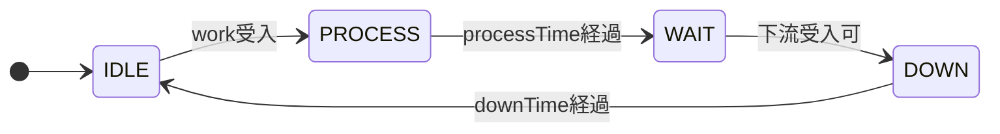

# FACT SIM における状態遷移ベース離散事象シミュレーション
## ブラウザ実装と最小時間パラメータ化の数理的整理

## 要旨

FACT SIM は、ブラウザ上で動作するノードベースの汎用離散事象シミュレータである。対象は生産ライン、搬送、物流、サービス工程など、エンティティが工程間を移動しながら状態遷移とイベントによって振る舞う系全般である。本資料では、FACT SIM の現行実装を、UI の説明ではなく、状態機械、有向グラフ、時間発展則として数理的に整理する。

本実装の中心的な特徴は、Equipment 系ノードを 4 状態

- `IDLE`
- `PROCESS`
- `WAIT`
- `DOWN`

で表現しながら、現場で同定すべき主要時間パラメータを

- `processTime`
- `downTime`

の 2 つへ集中させている点にある。`WAIT` や `IDLE` は独立の時間パラメータを持つのではなく、上下流の接続関係、滞留、受入可否から内生的に決まる。これにより、詳細作業を過剰に分解せずに、詰まり、待ち、同期、搬送制約を含む系全体の挙動を比較的少数のパラメータで再現できる。

さらに FACT SIM は、固定刻み時間で進む `dt` エンジン、次イベント時刻へジャンプする `event` エンジン、compiled 実行系である `event-fast`、その worker 分離版 `event-fast-worker`、並列 worker 実行版 `event-fast-par` を備える。現行実装では `dt` が比較基準の意味論を与え、`event` および `event-fast*` はその意味論を保ちながら実行効率を高める方向で設計されている。

---

## 1. 背景

現実の生産ラインや搬送系では、装置単体の処理時間だけでなく、下流待ち、合流待ち、経路分岐、故障停止、搬送資源制約などが全体性能を支配する。そのため、平均サイクルタイムの一覧表だけでは不十分であり、状態遷移に基づく離散事象シミュレーションが必要になる。

一方で、各工程を細かな作業要素に分解しすぎると、次の問題が生じやすい。

1. 状態数が増え、モデルが複雑化する。
2. 計測すべき時間パラメータが増え、同定コストが高くなる。
3. 微小な時間誤差が累積し、長時間シミュレーションの再現性を下げる。

FACT SIM はこの問題に対し、工程を状態遷移として扱いつつ、主要な時間パラメータを最小限に保つ実装を採る。特に Equipment 系では、実務上測りやすい `processTime` と `downTime` を核に据え、待ちはネットワークから自然に発生する量として表現する。

---

## 2. システム表現

### 2.1 有向グラフとしてのモデル

シミュレーション対象を有向グラフ

$$
\mathcal{G}=(\mathcal{V},\mathcal{E})
$$

で表す。

- $\mathcal{V}$: ノード集合。`Source`, `Equipment`, `Split`, `Branch`, `Merge`, `Join`, `Station`, `Sink`, `Carrier Route`, `Shuttle Stage` などを含む。
- $\mathcal{E}$: ノード間リンク集合。work ポート、carrier ポートなどの接続を表す。

時刻 $t$ におけるノード $i \in \mathcal{V}$ の状態を

$$
x_i(t)\in \mathcal{S}_i
$$

とする。各ノードは内部状態、保有エンティティ、次状態遷移時刻 `_until`、上下流リンク状態を持つ。

### 2.2 エンティティ

ワークや搬送対象の個体を

$$
w_k=(\mathrm{id}_k,\ \mathrm{type}_k,\ t_k^{\mathrm{birth}},\ \theta_k)
$$

と表す。ここで $\mathrm{id}_k$ は個体識別子、$\mathrm{type}_k$ は分岐条件や routing に用いる属性、$t_k^{\mathrm{birth}}$ は生成時刻、$\theta_k$ は任意の付加属性である。FACT SIM の実装では、この属性は branch 条件や script 判定に利用される。

---

## 3. Equipment ノードの状態機械

### 3.1 状態集合

Equipment 系ノードの基本状態集合を

$$
\mathcal{S}_{\mathrm{equip}}
=\{\mathsf{IDLE},\mathsf{PROCESS},\mathsf{WAIT},\mathsf{DOWN}\}
$$

とする。

- `IDLE`: 入力待ち
- `PROCESS`: 加工中
- `WAIT`: 加工完了後、下流受入待ち
- `DOWN`: 排出後のダウンまたは復帰待ち

概念的な遷移図は次のようになる。

### 3.2 時間発展

ノード $i$ が時刻 $t_a$ にワーク $w$ を受理したとする。`processTime` を $p_i(w)$、`downTime` を $d_i$ とおく。

`PROCESS` 区間は

$$
\begin{aligned}
x_i(t)&=\mathsf{PROCESS},\\
t&\in [\,t_a,\ t_a+p_i(w)\,)
\end{aligned}
$$

と書ける。

加工終了後、下流ノード $j$ が受入可能になる最初の時刻を

$$
t_h=\inf\{\,t\ge t_a+p_i(w)\mid \mathcal{A}_j(t)=1\,\}
$$

とすると、`WAIT` 区間は

$$
\begin{aligned}
x_i(t)&=\mathsf{WAIT},\\
t&\in [\,t_a+p_i(w),\ t_h\,)
\end{aligned}
$$

である。ここで $\mathcal{A}_j(t)\in\{0,1\}$ は下流ノード $j$ の受入可能性である。

排出後の `DOWN` 区間は

$$
\begin{aligned}
x_i(t)&=\mathsf{DOWN},\\
t&\in [\,t_h,\ t_h+d_i\,)
\end{aligned}
$$

となり、その後

$$
x_i(t)=\mathsf{IDLE},\qquad t\ge t_h+d_i
$$

へ復帰する。

### 3.3 実効サイクル時間

ワーク $w$ に対するノード $i$ の実効サイクル時間を

$$
C_i(w)=p_i(w)+b_i(w)+d_i
$$

と定義する。ここで

$$
b_i(w)=t_h-(t_a+p_i(w))
$$

は blocking に起因する待ち時間である。

この式により、装置固有の時間は $p_i$ と $d_i$ の 2 つで表され、詰まりや同期ずれは $b_i$ としてネットワークから自然に発生する。

---

## 4. 最小時間パラメータ化

### 4.1 4 状態と 2 パラメータ

FACT SIM の Equipment は 4 状態で動作するが、ユーザが主に与える時間パラメータは

- `processTime`
- `downTime`

の 2 つである。`WAIT` と `IDLE` は追加の独立時間パラメータを持たず、ネットワーク構造とその時点の滞留状況から決まる内生状態である。

したがって FACT SIM は、

- 表現上は 4 状態
- 同定上は 2 主要時間パラメータ

という構造を持つ。これは、状態数と計測項目を抑えつつ、工程間相互作用を保持する粗視化モデルとみなせる。

### 4.2 粗視化した 2 区間表現

1 ワークの通過時間を次の 2 区間へ粗視化して見てもよい。

主処理区間:

$$
P_i(w)=p_i(w)
$$

排出・復帰区間:

$$
T_i(w)=b_i(w)+d_i
$$

したがって

$$
C_i(w)=P_i(w)+T_i(w)
$$

となる。ここで `WAIT` は外生パラメータではなく、系の混雑と同期から出る量である点が重要である。

---

## 5. 分岐・合流・同期ノード

### 5.1 Source

`Source` はワーク列

$$
\mathcal{W}=(w_1,w_2,\dots)
$$

を生成し、下流受入可能時に投入する。生成間隔、初期時刻、タイプ列は投入計画に対応する。

### 5.2 Sink

`Sink` は到着ワーク総数 $N(t)$ を記録し、サイクルタイムと throughput を観測する。到着時刻列を $\{\,t_k^{\mathrm{sink}}\,\}$ とすると、ワーク単位のサイクルタイムは

$$
\mathrm{CT}_k=t_k^{\mathrm{sink}}-t_{k-1}^{\mathrm{sink}}
$$

である。

1 時間窓 throughput を $\mathrm{TPH}(t)$ とすると、概念的には

$$
\mathrm{TPH}(t)=
\begin{cases}
\dfrac{N(t)}{t/3600}, & 0<t<3600\\[4pt]
N(t)-N(t-3600), & t\ge 3600
\end{cases}
$$

で表せる。現行実装の `Sink` は履歴配列からこれに対応する指標を計算し、ノード内表示とタイムラインへ反映する。

### 5.3 Split

`Split` は下流全てが受入可能なときにワークを複製し、複数出力へ同時送出する。出力先集合を $\Gamma_i^{+}$ とすると、発火条件は

$$
\forall j\in \Gamma_i^{+},\ \mathcal{A}_j(t)=1
$$

である。

### 5.4 Branch

`Branch` はワーク属性に応じて出力先を選ぶ。出力候補 $m\in\Gamma_i^{+}$ に対して routeType 条件を用いるなら、

$$
j=\arg\max_{m\in \Gamma_i^{+}}
\mathbf{1}\{\mathrm{routeType}_m=\mathrm{type}(w)\}
$$

のように書ける。

### 5.5 Merge

`Merge` は複数入力から同一 ID のワークが揃ったときに 1 つのワークとして流す同期合流である。必要入力集合を $\Gamma_i^{-}$ とすると、ある ID $\widehat{\mathrm{id}}$ に対し

$$
\forall \ell\in \Gamma_i^{-},\ \exists w_\ell:\ 
\mathrm{id}(w_\ell)=\widehat{\mathrm{id}}
$$

が成立した時に発火する。

### 5.6 Join

`Join` は同期条件を持たない多入力 1 出力の FCFS 合流に相当する。

---

## 6. 搬送系ノード

FACT SIM の現行実装には `Carrier Route`、`Shuttle Stage`、`Station` など、Equipment より複雑なノードが含まれる。これらは work に加えて carrier や pallet を明示的に扱うため、状態空間は Equipment より大きい。

数理的には、これらは

- 搬送資源状態
- 積載状態
- route 選択
- 受渡し同期

を含む複合状態機械として扱うべきである。現状の実装では script 条件やノード固有ロジックで柔軟に表現されているが、厳密な定式化は今後の課題として残る。

---

## 7. エンジンの時間発展則

FACT SIM には複数の実行エンジンがある。

- `dt`
- `event`
- `event-fast`
- `event-fast-worker`
- `event-fast-par`

### 7.1 dt エンジン

`dt` は固定刻み幅

$$
\Delta t=0.1\ \mathrm{s}
$$

で時刻を進める。

$$
t_{k+1}=t_k+\Delta t
$$

各刻みで全ノードの状態更新を行うため、意味論が直感的で追いやすい。一方、長時間・大規模モデルでは、状態が変わらない区間でも更新が走る。

### 7.2 event エンジン

`event` は各ノードが持つ次状態遷移時刻 `_until` に基づき、最も近いイベント時刻へジャンプする。時刻 $t$ における有効な次イベント時刻集合を

$$
\mathcal{T}(t)=\{\,u_i(t)\mid i\in \mathcal{V},\ u_i(t)>t\,\}
$$

とすると、次時刻は

$$
t_{k+1}=\min \mathcal{T}(t_k)
$$

で与えられる。実装上は heap を用い、dirty queue や same-time batch を伴って処理する。

### 7.3 event-fast

`event-fast` は `event` の意味論を保ちながら、compiled graph、typed array 寄りの実行状態、軽量 kernel、compat fallback を用いてオーバーヘッドを削減する高速化バリアントである。意味論的には `event` 系の一種であり、`dt` との parity を `Engine Test` で確認する前提になっている。

### 7.4 event-fast-worker

`event-fast-worker` は `event-fast` を Web Worker 側へ移して UI thread と分離する構成である。主目的は UI の応答性改善であり、graph が worker 実行に不向きな場合は安全側へ fallback する。

### 7.5 event-fast-par

`event-fast-par` は graph partition と multi-worker 実行を用いる並列版である。概念的には partition ごとに局所イベント列を持ち、境界イベントを coordinator が同期する構成である。ただし現行実装では、graph 構造や fallback ノード種別によっては parallel 実行を避け、安全な `event-fast-worker` または `event-fast` 相当へ落とす。

したがって `event-fast-par` は

- 常に並列で動くエンジン

ではなく、

- 並列化可能な graph では multi-worker 実行
- そうでない graph では parity 優先で fallback

する実装と捉えるのが正確である。

### 7.6 計算量の見方

固定刻み幅法では、おおむね

$$
O((H/\Delta t)\cdot |V|)
$$

の更新が必要になる。ここで $H$ はシミュレーション時間である。

一方、イベント駆動法ではイベント数を $K$ として

$$
O(K\log K)
$$

型の振る舞いを期待できる。実際の定数因子は heap、dirty queue、compat fallback、snapshot 同期などの実装要因に依存するが、「変化のない時間を刻まない」ことが本質的な利点である。

---

## 8. ボトルネックと blocking

ノード $i$ の平均実効サイクル時間を

$$
\bar{C}_i=\mathbb{E}[C_i(w)]
$$

とする。直列ラインの粗い近似としてライン throughput $\mathrm{TP}$ は

$$
\mathrm{TP}\lesssim \frac{1}{\max_i \bar{C}_i}
$$

で上から抑えられる。

ただし FACT SIM では $\bar{C}_i$ の中に blocking 起因の $b_i$ が含まれるため、単純な `processTime` の最大値だけではボトルネックを説明できない。すなわち、ボトルネックは

- 処理そのものが遅い工程

だけではなく、

- 下流待ちを上流へ伝播させる構造点

でもある。

このため、タイムライン、node 状態表示、Sink 指標、engine test における parity 比較は、単なる速度比較ではなく、blocking 構造の説明可能性を支える。

---

## 9. 実装上の意味

### 9.1 現場導入しやすい理由

FACT SIM が実務向きである理由は次の 3 点に整理できる。

1. 時間パラメータが少ない  
   まず `processTime` と `downTime` を与えれば Equipment 系の多くを動かせる。

2. 待ちはモデルの外ではなく中で発生する  
   下流が詰まれば `WAIT` が自然に伸びる。

3. 図と数理が対応しやすい  
   LiteGraph 上のノード接続を、そのまま有向グラフ $\mathcal{G}=(\mathcal{V},\mathcal{E})$ と読める。

### 9.2 説明可能性

FACT SIM は単なるアニメーションではなく、

- timeline
- node state
- sink KPI
- CSV / snapshot / report

を通じて「なぜその throughput になったか」を説明しやすい。現行実装では `Engine Test` が `dt` を基準に各エンジンの parity を確認するため、速度改善と意味論維持を分離して議論できる。

---

## 10. 制約と今後の課題

本モデルと実装には、以下の制約がある。

1. `WAIT` や `IDLE` はネットワーク依存の内生状態であり、解析的閉形式を得にくい。
2. script による条件分岐は柔軟だが、形式検証を難しくする。
3. `event-fast` の compiled kernel と compat fallback の境界は、理論モデルとしてさらに整理の余地がある。
4. `Carrier Route` や `Shuttle Stage` は Equipment より複雑であり、別節での詳細定式化が望ましい。
5. `event-fast-worker` と `event-fast-par` は意味論優先で fallback を含むため、常に同一の実行戦略で動くわけではない。

---

## 11. 結論

FACT SIM は、ブラウザ上で動作する実用的なノードベース離散事象シミュレータであり、状態遷移ベースの時間発展とグラフベースのモデル記述を統合している。その中核は、Equipment を 4 状態で表しながら、時間同定の中心を `processTime` と `downTime` の 2 つへ集約する点にある。

この設計により、

- モデル化のしやすさ
- 実行速度
- 説明可能性
- 現場導入性

のバランスが取られている。したがって FACT SIM は、単なる可視化ツールではなく、状態遷移を基礎とした実務向け離散事象シミュレーション基盤として位置づけられる。

---

## 付録 A. 実装用語と数理対応

| 実装用語 | 数理的対応 |
| --- | --- |
| `Source` | ワーク発生過程 |
| `Equipment` | 4 状態サービスノード |
| `Split` | 同期複製ノード |
| `Branch` | 属性ベース分岐ノード |
| `Merge` | 同期合流ノード |
| `Join` | FCFS 合流ノード |
| `Sink` | 観測終端・性能計測点 |
| `processTime` | $p_i(w)$ |
| `downTime` | $d_i$ |
| `WAIT` | blocking の顕在化状態 |
| `_until` | 次状態遷移時刻 |

## 付録 B. 現行実装におけるエンジン位置づけ

| エンジン | 役割 | 備考 |
| --- | --- | --- |
| `dt` | 基準意味論 | parity 比較のベースライン |
| `event` | 単一スレッド event heap | `_until` に基づくジャンプ |
| `event-fast` | compiled event 実行 | kernel + compat fallback |
| `event-fast-worker` | worker 分離 | UI thread と simulation 分離 |
| `event-fast-par` | 並列 worker 実行 | graph 条件により fallback あり |
