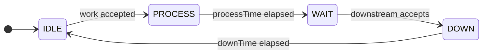

# State-Transition-Based Discrete-Event Simulation in FACT SIM
## A Mathematical Interpretation of the Browser Implementation and Minimal Time Parameterization

## Abstract

FACT SIM is a browser-based, node-oriented general-purpose discrete-event simulator. Its target systems include manufacturing lines, transport systems, logistics, and service processes, that is, systems in which entities move through a network by means of events and state transitions. This document explains the current implementation of FACT SIM not as a UI guide but as a mathematical model based on state machines, directed graphs, and time-evolution rules.

A central feature of the implementation is that Equipment-like nodes are represented by four states

- `IDLE`
- `PROCESS`
- `WAIT`
- `DOWN`

while the main measurable time parameters are concentrated into only two quantities:

- `processTime`
- `downTime`

`WAIT` and `IDLE` do not normally require independent duration parameters. Instead, they emerge endogenously from upstream/downstream connectivity, congestion, and acceptance conditions. This design allows FACT SIM to reproduce blocking, waiting, synchronization, and transport constraints without excessively decomposing each operation into fine-grained substeps.

FACT SIM also provides multiple execution engines: the fixed-step `dt` engine, the event-driven `event` engine, the compiled execution variant `event-fast`, its worker-isolated form `event-fast-worker`, and the multi-worker parallel engine `event-fast-par`. In the current implementation, `dt` acts as the semantic baseline, while `event` and `event-fast*` aim to preserve the same observable behavior with lower execution overhead.

---

## 1. Background

In real production and transport systems, overall performance is governed not only by nominal processing times but also by downstream blocking, merge waits, route decisions, failure stops, and transport-resource constraints. Therefore, a simple list of average cycle times is insufficient; discrete-event simulation based on explicit state transitions is required.

At the same time, over-decomposing each process into many micro-activities introduces several problems:

1. The number of states grows and the model becomes difficult to maintain.
2. The number of time parameters to measure increases, raising calibration cost.
3. Small timing errors accumulate, reducing long-run reproducibility.

FACT SIM addresses this tradeoff by representing each process as a state-transition system while keeping the main time parameters minimal. In particular, Equipment-like nodes are centered on `processTime` and `downTime`, while waiting is generated naturally by network interactions rather than imposed as an external parameter.

---

## 2. System Representation

### 2.1 Directed-Graph Model

The simulated system is represented as a directed graph

$$
\mathcal{G}=(\mathcal{V},\mathcal{E})
$$

where:

- $\mathcal{V}$ is the set of nodes, including `Source`, `Equipment`, `Split`, `Branch`, `Merge`, `Join`, `Station`, `Sink`, `Carrier Route`, and `Shuttle Stage`.
- $\mathcal{E}$ is the set of directed links, including work ports and carrier ports.

The state of node $i \in \mathcal{V}$ at time $t$ is written as

$$
x_i(t)\in \mathcal{S}_i
$$

Each node maintains an internal state, resident entities, link-related conditions, and a next-transition timestamp `_until`.

### 2.2 Entities

A work item or transportable entity is represented as

$$
w_k=(\mathrm{id}_k,\ \mathrm{type}_k,\ t_k^{\mathrm{birth}},\ \theta_k)
$$

where $\mathrm{id}_k$ is the unique identifier, $\mathrm{type}_k$ is an attribute used for routing or branching, $t_k^{\mathrm{birth}}$ is the birth time, and $\theta_k$ denotes optional additional attributes. In the current implementation, these attributes are used by branch conditions and scripted node logic.

---

## 3. State Machine of Equipment Nodes

### 3.1 State Set

The basic state set of Equipment-like nodes is

$$
\mathcal{S}_{\mathrm{equip}}
=\{\mathsf{IDLE},\mathsf{PROCESS},\mathsf{WAIT},\mathsf{DOWN}\}
$$

with the following meanings:

- `IDLE`: waiting for an input entity
- `PROCESS`: actively processing
- `WAIT`: processing is complete, but downstream cannot yet accept the item
- `DOWN`: post-discharge downtime or recovery period

The conceptual transition diagram is:

### 3.2 Time Evolution

Assume that node $i$ accepts work $w$ at time $t_a$. Let $p_i(w)$ denote `processTime` and $d_i$ denote `downTime`.

The `PROCESS` interval is

$$
\begin{aligned}
x_i(t)&=\mathsf{PROCESS},\\
t&\in [\,t_a,\ t_a+p_i(w)\,)
\end{aligned}
$$

Let the earliest time at which downstream node $j$ becomes able to accept the item be

$$
t_h=\inf\{\,t\ge t_a+p_i(w)\mid \mathcal{A}_j(t)=1\,\}
$$

Then the `WAIT` interval is

$$
\begin{aligned}
x_i(t)&=\mathsf{WAIT},\\
t&\in [\,t_a+p_i(w),\ t_h\,)
\end{aligned}
$$

where $\mathcal{A}_j(t)\in\{0,1\}$ is the downstream acceptance indicator.

After handoff, the `DOWN` interval is

$$
\begin{aligned}
x_i(t)&=\mathsf{DOWN},\\
t&\in [\,t_h,\ t_h+d_i\,)
\end{aligned}
$$

and the node returns to

$$
x_i(t)=\mathsf{IDLE},\qquad t\ge t_h+d_i
$$

### 3.3 Effective Cycle Time

The effective cycle time of node $i$ for work $w$ is defined as

$$
C_i(w)=p_i(w)+b_i(w)+d_i
$$

where

$$
b_i(w)=t_h-(t_a+p_i(w))
$$

is the blocking-induced waiting time.

This makes it explicit that the intrinsic node-specific time is captured by $p_i$ and $d_i$, while blocking and synchronization delays arise from network interactions through $b_i$.

---

## 4. Minimal Time Parameterization

### 4.1 Four States, Two Main Parameters

Although FACT SIM uses four operational states, the main user-specified time parameters are only:

- `processTime`
- `downTime`

`WAIT` and `IDLE` do not normally require separate calibrated durations; they are endogenous states determined by the network configuration and instantaneous congestion.

Therefore, FACT SIM has the following structure:

- four explicit operational states at the representation level
- two principal time parameters at the calibration level

This can be interpreted as a coarse-grained model that preserves process interaction while reducing the number of parameters that must be measured in practice.

### 4.2 Coarse Two-Segment View

The traversal time of a work item through a node can be viewed in terms of two segments.

Primary processing segment:

$$
P_i(w)=p_i(w)
$$

Discharge and recovery segment:

$$
T_i(w)=b_i(w)+d_i
$$

Hence

$$
C_i(w)=P_i(w)+T_i(w)
$$

The key point is that `WAIT` is not an exogenous timing parameter; it emerges from congestion and synchronization in the network.

---

## 5. Branching, Merging, and Synchronization Nodes

### 5.1 Source

A `Source` generates a sequence

$$
\mathcal{W}=(w_1,w_2,\dots)
$$

and injects work when downstream acceptance conditions are satisfied. Inter-arrival intervals, start time, and type sequence correspond to the release plan.

### 5.2 Sink

A `Sink` records the cumulative number of completed works $N(t)$ and derives cycle-time and throughput measures. If $\{\,t_k^{\mathrm{sink}}\,\}$ is the arrival-time sequence at the sink, then the per-item cycle time is

$$
\mathrm{CT}_k=t_k^{\mathrm{sink}}-t_{k-1}^{\mathrm{sink}}
$$

The one-hour throughput measure $\mathrm{TPH}(t)$ can be written as follows. Before one hour of simulated time has elapsed:

$$
\mathrm{TPH}(t)=\dfrac{N(t)}{t/3600}, \qquad 0<t<3600
$$

After one hour, it becomes the number of completions observed in the most recent one-hour window:

$$
\mathrm{TPH}(t)=N(t)-N(t-3600), \qquad t\ge 3600
$$

The current implementation computes corresponding indicators from completion histories and displays them inside the sink node and on the timeline.

### 5.3 Split

A `Split` duplicates a work item and emits copies simultaneously to multiple outputs when all downstream targets can accept. Let $\Gamma_i^{+}$ be the output set of node $i$. Then the firing condition is

$$
\forall j\in \Gamma_i^{+},\ \mathcal{A}_j(t)=1
$$

### 5.4 Branch

A `Branch` selects an output according to work attributes. If route selection is determined by an output-specific route type, a stylized expression is

$$
j=\arg\max_{m\in \Gamma_i^{+}}
\mathbf{1}\{\mathrm{routeType}_m=\mathrm{type}(w)\}
$$

### 5.5 Merge

A `Merge` is a synchronized merge node: it emits one work item when inputs carrying the same identifier have arrived at all required inputs. Let $\Gamma_i^{-}$ be the required input set. For a target identifier $\widehat{\mathrm{id}}$, the firing condition is

$$
\forall \ell\in \Gamma_i^{-},\ \exists w_\ell:\ 
\mathrm{id}(w_\ell)=\widehat{\mathrm{id}}
$$

### 5.6 Join

A `Join` is a multi-input, single-output merge without an explicit synchronization constraint, and is well approximated as a first-come-first-served merge node.

---

## 6. Transport-Oriented Nodes

The current FACT SIM implementation also contains more complex nodes such as `Carrier Route`, `Shuttle Stage`, and `Station`. These nodes explicitly handle carriers, pallets, and transfer synchronization, so their state spaces are larger than those of Equipment nodes.

Mathematically, these nodes should be treated as composite state machines including:

- transport-resource state
- loading state
- route selection
- handoff synchronization

In the present implementation, such logic is expressed via node-specific code and optional scripting. A stricter formalization remains future work.

---

## 7. Time Evolution Rules of the Engines

FACT SIM currently provides multiple simulation engines:

- `dt`
- `event`
- `event-fast`
- `event-fast-worker`
- `event-fast-par`

### 7.1 The dt Engine

The `dt` engine advances time by a fixed step

$$
\Delta t=0.1\ \mathrm{s}
$$

so that

$$
t_{k+1}=t_k+\Delta t
$$

All nodes are updated at every step. This makes the semantics easy to follow, but it also means that unchanged intervals are still visited explicitly.

### 7.2 The event Engine

The `event` engine advances directly to the nearest future event time using each node's `_until` timestamp. Let the set of valid future event times at time $t$ be

$$
\mathcal{T}(t)=\{\,u_i(t)\mid i\in \mathcal{V},\ u_i(t)>t\,\}
$$

Then the next simulation time is

$$
t_{k+1}=\min \mathcal{T}(t_k)
$$

In the implementation, this is supported by a heap together with dirty queues and same-time batching.

### 7.3 event-fast

`event-fast` is a performance-oriented variant that preserves the semantics of `event` while reducing overhead using a compiled graph representation, typed-array-oriented runtime data, lightweight kernels, and compatibility fallback logic. Semantically, it remains an event-driven engine and is validated against `dt` through engine parity testing.

### 7.4 event-fast-worker

`event-fast-worker` moves `event-fast` execution into a Web Worker, separating simulation from the UI thread. Its primary purpose is responsiveness rather than a change of semantics. When a graph is unsuitable for worker execution, the implementation falls back to a safer runtime path.

### 7.5 event-fast-par

`event-fast-par` is the parallel multi-worker variant based on graph partitioning. Conceptually, each partition maintains a local event sequence while a coordinator synchronizes boundary events across partitions. In the current implementation, however, not all graphs are executed in fully parallel form. Depending on graph structure and fallback node types, the runtime may downgrade to `event-fast-worker` or `event-fast` in order to preserve parity.

Thus, `event-fast-par` should be understood not as "always parallel," but rather as:

- multi-worker execution when the graph is parallelizable
- parity-first fallback when it is not

### 7.6 Computational Viewpoint

Under fixed-step simulation, the number of updates is on the order of

$$
O((H/\Delta t)\cdot |V|)
$$

where $H$ is the simulated horizon.

Under event-driven execution, if the total number of events is $K$, one expects behavior of the form

$$
O(K\log K)
$$

up to implementation-dependent constants. In practice, those constants depend on the heap, dirty queues, fallback paths, and snapshot synchronization. The essential advantage is that intervals with no state changes are skipped.

---

## 8. Blocking and Bottlenecks

Let the mean effective cycle time of node $i$ be

$$
\bar{C}_i=\mathbb{E}[C_i(w)]
$$

Then, as a rough upper bound for a serial line, line throughput $\mathrm{TP}$ satisfies

$$
\mathrm{TP}\lesssim \frac{1}{\max_i \bar{C}_i}
$$

However, in FACT SIM, $\bar{C}_i$ already includes the blocking term $b_i$. Therefore, the bottleneck is not necessarily the node with the largest nominal `processTime`; it may instead be the structural point that propagates downstream blocking upstream.

This is why the timeline, node-state views, sink metrics, and engine parity tests are useful not only for speed comparison but also for explaining why throughput is limited.

---

## 9. Practical Meaning of the Implementation

### 9.1 Why It Is Practical for Real Sites

FACT SIM is practical in real settings for three reasons.

1. Few time parameters are required.  
   In many cases, giving `processTime` and `downTime` is enough to obtain useful behavior.

2. Waiting is generated inside the model.  
   If downstream nodes are blocked, `WAIT` automatically grows.

3. The diagram aligns naturally with the mathematics.  
   A LiteGraph node-link diagram can be interpreted directly as the directed graph $\mathcal{G}=(\mathcal{V},\mathcal{E})$.

### 9.2 Explainability

FACT SIM is not merely an animation tool. Through

- timelines
- node-state displays
- sink KPIs
- CSV, snapshot, and report outputs

it helps explain why a given throughput is observed. In the current implementation, `Engine Test` uses `dt` as the baseline and checks parity of the alternative engines, making it possible to separate semantic correctness from execution-speed improvement.

---

## 10. Limitations and Future Work

The current model and implementation still have several limitations.

1. `WAIT` and `IDLE` are endogenous network-dependent states, making closed-form analysis difficult.
2. Script-based branching is flexible, but it also makes formal verification harder.
3. The theoretical boundary between compiled kernels and compatibility fallback in `event-fast` can be further clarified.
4. `Carrier Route` and `Shuttle Stage` are more complex than Equipment nodes and deserve dedicated formal treatment.
5. `event-fast-worker` and `event-fast-par` include fallback paths, so a single graph does not always execute under one uniform runtime strategy.

---

## 11. Conclusion

FACT SIM is a practical browser-based node-oriented discrete-event simulation platform that integrates state-transition-based time evolution with graph-based model construction. Its core design choice is to represent Equipment nodes with four states while concentrating time identification around only two main parameters: `processTime` and `downTime`.

This design provides a workable balance among

- ease of modeling
- execution speed
- explainability
- practical deployability

Accordingly, FACT SIM should be understood not merely as a visualization tool, but as a practical state-transition-based discrete-event simulation foundation.

---

## Appendix A. Implementation Terms and Their Mathematical Counterparts

| Implementation term | Mathematical interpretation |
| --- | --- |
| `Source` | work-generation process |
| `Equipment` | four-state service node |
| `Split` | synchronized replication node |
| `Branch` | attribute-based branching node |
| `Merge` | synchronized merge node |
| `Join` | FCFS merge node |
| `Sink` | observation sink and performance measurement point |
| `processTime` | $p_i(w)$ |
| `downTime` | $d_i$ |
| `WAIT` | explicit blocking state |
| `_until` | next state-transition time |

## Appendix B. Engine Roles in the Current Implementation

| Engine | Role | Notes |
| --- | --- | --- |
| `dt` | baseline semantics | reference for parity comparison |
| `event` | single-thread event heap | jumps according to `_until` |
| `event-fast` | compiled event execution | kernels plus compatibility fallback |
| `event-fast-worker` | worker-isolated execution | separates UI thread and simulation |
| `event-fast-par` | parallel multi-worker execution | may fall back depending on graph conditions |
